<!--
	README for the chess-notes React SPA
	Generated: concise, friendly, and action-oriented
-->

# ♟️ Chess Notes

 

Welcome to **Chess Notes** — a small React single-page app (SPA) for taking, storing, and reviewing board-state notes while you study chess games. It's designed to be lightweight, serverless-friendly, and ready for future expansion to a backend API for persistent storage and sharing.

---

## ✨ Purpose

- Capture quick annotations tied to a specific board state during game analysis.
- Let players jot thoughts, ideas, and plans for positions while replaying or studying games.
- Provide a simple, responsive UI that works locally and is hosted with CI/CD via AWS Amplify.

## 🏗️ Architecture (current)

This repository is a React SPA built with Create React App and uses React Router for client-side navigation. Key UI pieces:

- `src/components/Board.jsx` — visual chessboard and moves rendering.
- `src/components/Game.tsx` — page/container for a full game view.
- `src/components/GameNotes.tsx` — component handling notes tied to board state.
- `src/components/GameStatus.jsx`, `Piece.jsx`, `Square.jsx` — smaller UI components.

Routing:

- React Router manages routes such as `/` (home), `/game/:id` (game view), and `/notes`.

Hosting / CI:

- The SPA is hosted on **AWS Amplify**, configured for continuous deployment using the GitHub ↔ Amplify integration (AWS GitHub App). Pushes to the repository automatically trigger Amplify builds and deploys.

## 🔮 Future (serverless) design

We envision a serverless backend to enable persistent, shared game notes.

- API Gateway -> AWS Lambda -> DynamoDB
- Purpose: persist board-state snapshots and notes, serve user queries, and enable syncing across devices.

Merits of this design:

- Serverless scales automatically and keeps the infrastructure footprint minimal.
- DynamoDB provides fast, low-latency access and a simple key design for gameId + plyIndex (or FEN hash) to retrieve position-specific notes.
- Lambda functions implement business logic (validation, authentication hooks, transformations).

Example flow:

1. `GameNotes` component POSTs note data to `/games/{gameId}/notes` on API Gateway.
2. API Gateway routes the request to a Lambda which validates and writes an item to DynamoDB:

	 - Partition key: `gameId`
	 - Sort key: `positionKey` (e.g., FEN or move index)
	 - Attributes: `noteId`, `text`, `author`, `createdAt`, `metadata`

3. A GET endpoint returns notes for a game/position for the UI to display.

Design decisions and rationale:

- Use FEN (or a deterministic position hash) as the sorting key so multiple notes can be tied to identical board states across different games.
- Keep the API surface minimal: CRUD for notes plus a small query surface for position-based retrieval.
- Auth can be added later (Cognito or OAuth via Amplify) to support private notes and collaboration.

## 🧩 Why serverless?

- Reduced operational overhead — no servers to patch or maintain.
- Pay-per-use pricing aligns well with an app that may have bursty but generally low traffic.
- Easy to extend: add Lambda functions for export/import, batch processing, or ML-based position tagging.

## 🛠️ Run locally

Install and start the dev server:

```bash
npm install
npm start
```

Open http://localhost:3000 in your browser.

Build for production (Amplify will run similar commands during CI):

```bash
npm run build
```

## 🗂️ Notes for contributors

- Keep UI state in the `Game`/`Board` parent components and pass notes down to `GameNotes`.
- Prefer serializable, minimal state for notes (avoid storing large DOM or binary blobs).
- If you add a backend, follow the API path `/.netlify/functions` or `/api` locally (or wire Amplify's mock endpoints) so CI/CD deploys run without client code changes.

## 🖼️ Visual / diagram

```mermaid
graph LR
	Browser[Browser / React SPA]
	Browser -->|React Router| Routes[Routes: /, /game/:id, /notes]
	Browser -->|POST / GET| APIGW[API Gateway]
	APIGW --> Lambda[Lambda]
	Lambda --> DynamoDB[(DynamoDB)]
	CI["GitHub → AWS GitHub App"]
	CI --> Amplify[Amplify]
	Amplify --> Browser
```



## 🚀 Next steps (ideas)

- Add an example API spec (OpenAPI) and a small Lambda prototype that accepts notes.
- Add Cognito-based auth via Amplify to support private notes.

---

Happy hacking! ♟️
